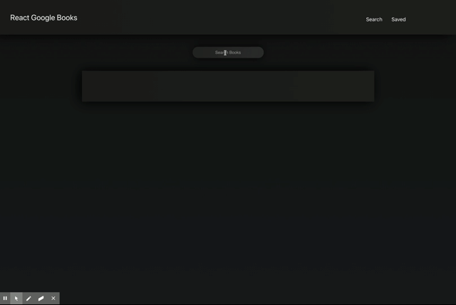
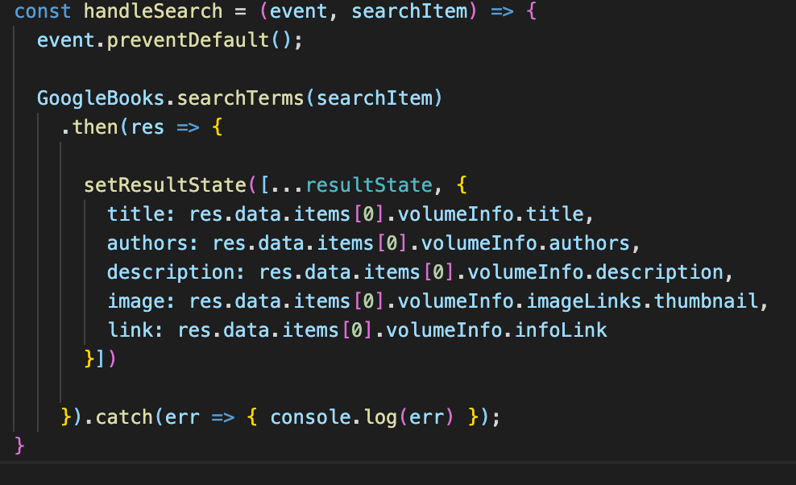

# Google Book Search

Find and save books using Google API. [Deployment](https://salty-chamber-90587.herokuapp.com/)

## Description

This app helps you organize the books that you wanted to read. It uses a Google API where you can search for books. You can save books that you enjoy and they will be saved to a database. Once you are done with the book, you can delete it from your saved page.

## Table of Contents

- [Installation](#installation)
- [Usage](#usage)
- [Technologies](#technologies)
- [Highlights](#highlights)
- [Learned](#learned)
- [Credits](#credits)
- [License](#license)

## Installation

Go to the deployed link. [Deployment](https://salty-chamber-90587.herokuapp.com/)

## Usage

1. Enter the book you want to search.
2. The title, author, description, book cover, and a Google link of the book summary will append in a card below.
3. You can save the book if you like it.
4. You can remove the book on the save page once you are done.

## Technologies

### Stack

- Mongodb
- Express
- React
- Node.js

## Highlights

This is a code highlight of searching for books on the app.js file. It uses axios to make an api call to the Google Books API. The state of the search gets updated with the relevant information for the Google Books API.

## Learned

- Learned how to make a fullstack MERN app.
- Learned how to use a Google Books API.

## Credits

David Anusontarangkul
[LinkedIn](https://www.linkedin.com/in/anusontarangkul/)
[Github](https://github.com/anusontarangkul)

Jonathan Honda
[LinkedIn](https://www.linkedin.com/in/jonathan-honda-778430153/)
[Github](https://github.com/hondahelix)

Aaron Diggdon
[LinkedIn](https://www.linkedin.com/in/aarondiggdon/)
[Github](https://github.com/aarondig)

This project was apart of the UC Berkeley Coding Bootcamp.

## License

Copyright <2020> <COPYRIGHT HOLDER>

Permission is hereby granted, free of charge, to any person obtaining a copy of this software and associated documentation files (the "Software"), to deal in the Software without restriction, including without limitation the rights to use, copy, modify, merge, publish, distribute, sublicense, and/or sell copies of the Software, and to permit persons to whom the Software is furnished to do so, subject to the following conditions:

The above copyright notice and this permission notice shall be included in all copies or substantial portions of the Software.

THE SOFTWARE IS PROVIDED "AS IS", WITHOUT WARRANTY OF ANY KIND, EXPRESS OR IMPLIED, INCLUDING BUT NOT LIMITED TO THE WARRANTIES OF MERCHANTABILITY, FITNESS FOR A PARTICULAR PURPOSE AND NONINFRINGEMENT. IN NO EVENT SHALL THE AUTHORS OR COPYRIGHT HOLDERS BE LIABLE FOR ANY CLAIM, DAMAGES OR OTHER LIABILITY, WHETHER IN AN ACTION OF CONTRACT, TORT OR OTHERWISE, ARISING FROM, OUT OF OR IN CONNECTION WITH THE SOFTWARE OR THE USE OR OTHER DEALINGS IN THE SOFTWARE.
